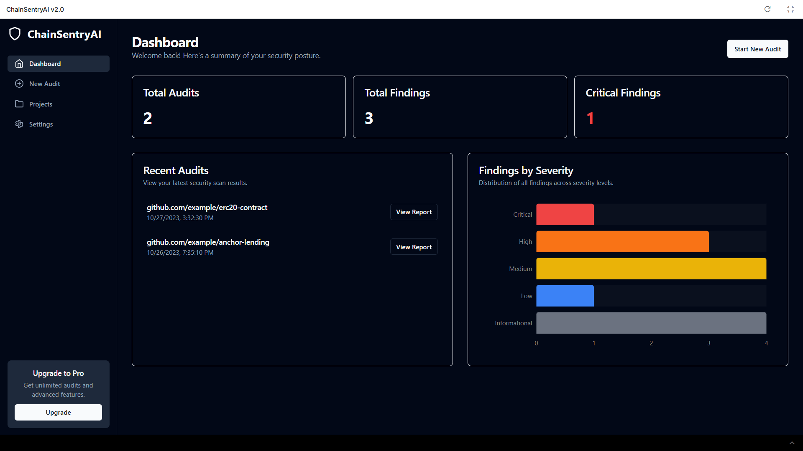
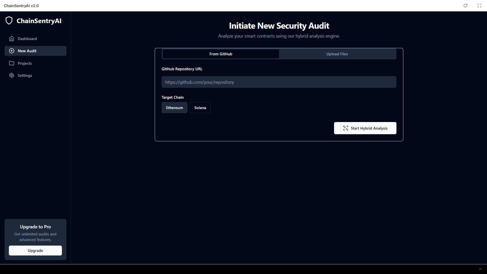
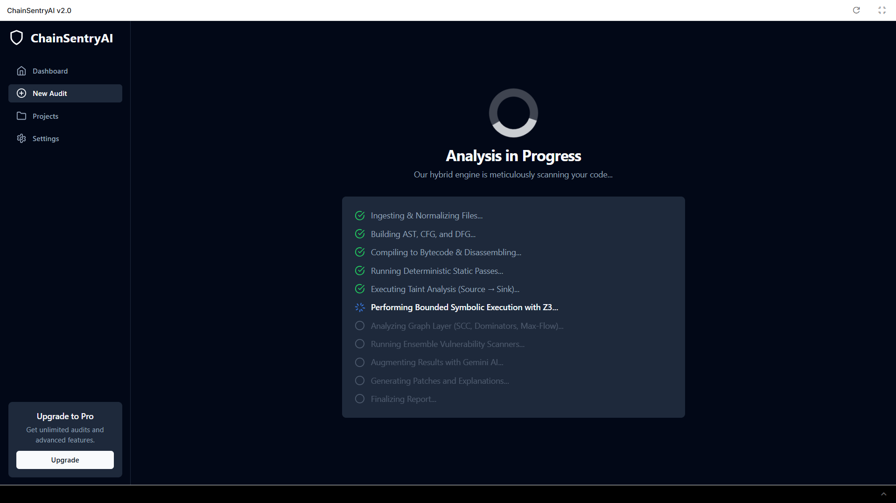
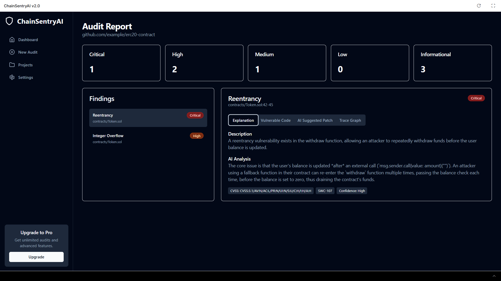
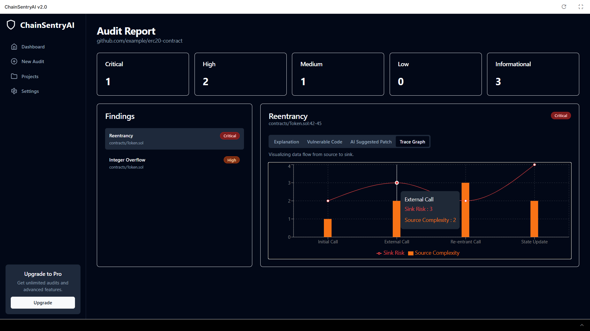

# ChainSentryAI v2.0

ChainSentryAI is a powerful, AI-augmented smart contract security auditor designed for Ethereum (Solidity) and Solana (Rust/Anchor). It combines a rigorous hybrid analysis engine with a polished, intuitive user interface to provide deep, actionable security insights.

This repository contains the frontend prototype, built with React and TypeScript, which demonstrates the core user experience in a fully interactive demo mode.

## Features

-   **Intuitive Dashboard**: Get a high-level overview of your security posture with key metrics and visualizations.
-   **Hybrid Audit Initiation**: Start new audits easily by providing a GitHub repository URL or by directly uploading contract files.
-   **Real-time Progress**: Monitor the multi-stage analysis process with a detailed progress screen that communicates each step of the audit.
-   **Detailed Audit Reports**: Dive deep into findings with a comprehensive report view.
-   **Interactive Code Viewer**: See vulnerabilities highlighted directly in your source code.
-   **AI-Generated Patches**: Instantly view suggested code fixes with a clear diff view.
-   **In-Depth Explanations**: Understand the root cause and impact of each vulnerability with detailed descriptions and AI-powered analysis.
-   **Data Visualization**: Analyze taint-flow and other complex relationships with integrated trace graphs.

## 🖼️ Screenshots / Demo

### Dashboard


### Input for Audit


### Audit in Progress


### Audit Report Showcase
<table>
<tr>
<td>

**Report 1**  


</td>
<td>

**Report 2**  


</td>
</tr>
</table>

## Tech Stack (Frontend Prototype)

-   **Framework**: React 18
-   **Language**: TypeScript
-   **Styling**: Tailwind CSS
-   **Charts**: Recharts
-   **Build Tool**: Vite (inferred from standard modern React setup)
-   **Dependencies**: `react-dropzone` for file uploads.

## Local Setup & Running the Project

Follow these steps to run the frontend prototype on your local machine.

1.  **Clone the Repository**
    ```bash
    git clone <repository-url>
    cd <repository-directory>
    ```

2.  **Install Dependencies**
    This project uses `npm` as its package manager.
    ```bash
    npm install
    ```

3.  **Run the Development Server**
    ```bash
    npm run dev
    ```
    This will start the development server, and you can view the application by navigating to `http://localhost:5173` (or another port if specified) in your browser.

4.  **Explore the Application**
    The application runs in **Demo Mode** by default. All data is mocked and sourced from `src/demo.ts`. You can interact with all UI components, start a simulated audit, and explore the pre-loaded audit reports without needing a backend connection.

---

Built by [Amay Tripathi](https://github.com/AmayTrip29).